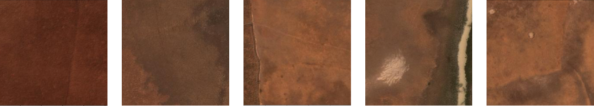
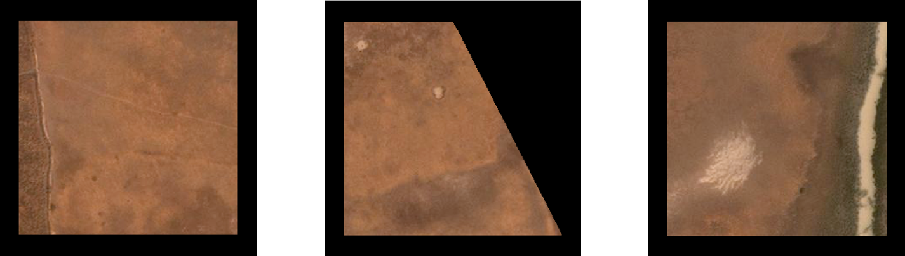

# Extract geojson features from an image

In this example, we use dataextractors to pull pixel data ('chips') from AOIs in the image 120030102013.tif. Each AOI is stored as a feature in [features.geojson](https://github.com/PlatformStories/dataextractors/blob/master/example/features.geojson), which includes the feature geometry, an image id reference, a feature id and a class name.

   
<sub>Sample image.</sub>

1. Import dataextractors and pull 10 chips of various sizes:

    ```python
    import dataextractors as de

    # Extract 10 chips from the image
    chips, labels = de.get_data('features.geojson', return_labels=True, num_chips=10)
    ```

      
    
    <sub>Extracted chips.</sub>

2. Create uniformly-sized chips with black masks over the area not included in the geometry:

    ```python
    # Extract uniformly-sized chips
    chips, one_hot_vecs = de.get_uniform_chips('features.geojson',
                                               classes=['No Buildings', 'Buildings'],
                                               num_chips=10, max_side_dim=260)
    ```

      
    
    <sub>Uniformly-sized chips; pixels outside the geometry are masked.</sub>

3. Create a uniform chip generator:

    ```python
    chip_gen = de.uniform_chip_generator('features.geojson', batch_size=10,
                                         max_side_dim=260,
                                         classes=['No Buildings', 'Buildings'])

    # Generate a batch of 10 chips
    chips, one_hot_vecs = chip_gen.next()
    ```
