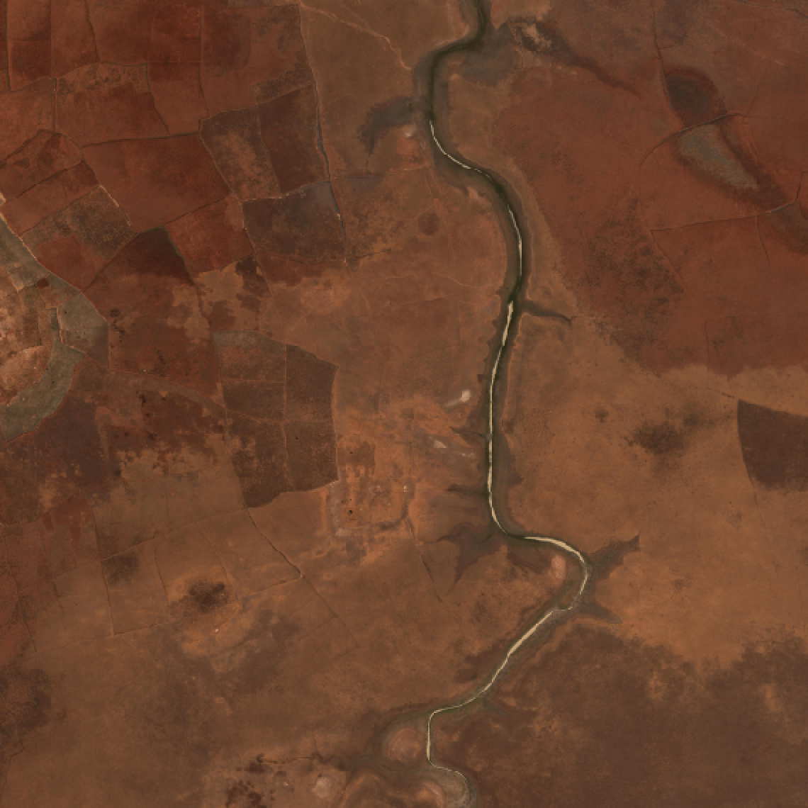

# Extract geojson features from an image

In this example, we use dataextractors to pull pixel data ('chips') from AOIs in an image. Each AOI is stored as a feature in [features.geojson](https://github.com/PlatformStories/dataextractors/blob/master/example/features.geojson), which includes the feature geometry, an image id reference, a feature id and a class name. We pull all chips from the image '120030102013.tif' (displayed below).

   
<sub>Original image from which we are pulling chips.</sub>

1. Import dataextractors and pull 10 chips from the imagery.

    ```python
    import dataextractors as de

    # Extract 10 chips from the image
    chips, labels = de.get_data('features.geojson', return_labels=True, num_chips=10)
    ```

      
    <sub>Chips extracted from above example'</sub>

2. Note that the above command will return the entire bounding box, yielding various chip sizes. We can also create uniformly-sized chips (300px x 300 px) with black masks over the area not included in the geometry.:

    ```python
    # Extract uniformly-sized chips
    chips, labels = de.get_uniform_chips('features.geojson',
                                         classes=['No Buildings', 'Buildings'],
                                         num_chips=10, max_side_dim=260)
    ```

      
    <sub>Uniform chips produced above. Notice the bounding boxes are returned, but any pixels outside of the geometry are blacked out.</sub>

3. Finally, we can create a uniform chip generator as follows:

    ```python
    chip_gen = de.uniform_chip_generator('features.geojson', batch_size=10,
                                         max_side_dim=260,
                                         classes=['No Buildings', 'Buildings'])

    # Generate a batch of 10 chips
    chips, labels = chip_gen.next()
    ```
